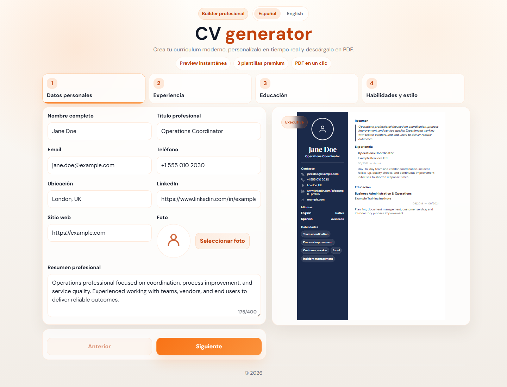

# CV Generator

Generador de curriculum moderno hecho con **SvelteKit **. Funciona 100 % en el cliente: rellenas el formulario, ves la preview A4 en tiempo real y descargas el resultado como PDF.



## Lo que incluye

- Formulario por pasos con datos personales, experiencia, educacion, habilidades e idiomas.
- Preview en vivo con 3 plantillas: Executive, Editorial y Minimal.
- Exportacion a PDF con `html2canvas` + `jsPDF`.
- Interfaz bilingue ES / EN.
- PWA instalable en movil.
- Branding opcional desde Sanity: logo, colores, textos y SEO.
- Headers basicos de seguridad listos para produccion.

## Stack

- SvelteKit  + Svelte runes
- TypeScript
- Vite
- Sanity opcional
- html2canvas / jsPDF

## Puesta en marcha

```bash
npm install
npm run dev
```

Abre `http://localhost:5173`.

## Variables de entorno

Copia `.env.example` a `.env` y ajusta lo que necesites:

| Variable | Uso |
| --- | --- |
| `PUBLIC_SITE_URL` | URL publica sin barra final, usada en SEO y sitemap. |
| `PUBLIC_APP_CREDIT_URL` | Enlace opcional del footer. |
| `PUBLIC_APP_CREDIT_LABEL` | Texto opcional del enlace del footer. |
| `PUBLIC_SANITY_PROJECT_ID` | ID de Sanity si quieres CMS. |
| `PUBLIC_SANITY_DATASET` | Dataset de Sanity, normalmente `production`. |
| `PUBLIC_SANITY_API_VERSION` | Version de API, por defecto `2024-01-01`. |
| `SANITY_READ_TOKEN` | Token privado solo si el dataset no es publico. No lo subas al repo. |

Sanity es opcional. Sin esas variables, la app usa los textos locales de `src/lib/i18n/` y los colores por defecto.

## Scripts

```bash
npm run dev       # desarrollo
npm run check     # tipos + svelte-check
npm run build     # build de produccion
npm run preview   # previsualizar build
npm run studio    # Sanity Studio desde /studio
```

## Estructura

```txt
src/routes/+page.svelte          App principal
src/lib/cv/                      Formularios, preview, plantillas y PDF
src/lib/i18n/                    Traducciones ES / EN
src/lib/pwa/                     Prompt de instalacion PWA
src/lib/sanity/                  Lectura opcional de branding desde Sanity
src/hooks.server.ts              Headers de seguridad
static/                          Iconos PWA, manifest y captura
studio/                          Sanity Studio opcional
```

## Seguridad

- No se persisten datos del CV en servidor por defecto.
- El token privado de Sanity solo se lee desde `$env/dynamic/private`.
- No hay renderizado de HTML de usuario.
- El endpoint `/api/locale` valida origen en peticiones `POST`.
- Las respuestas HTML incluyen CSP basica, `X-Frame-Options`, `X-Content-Type-Options`, `Referrer-Policy` y `Permissions-Policy`.

## Licencia

PolyForm Noncommercial 1.0.0. Consulta [LICENSE](LICENSE).
